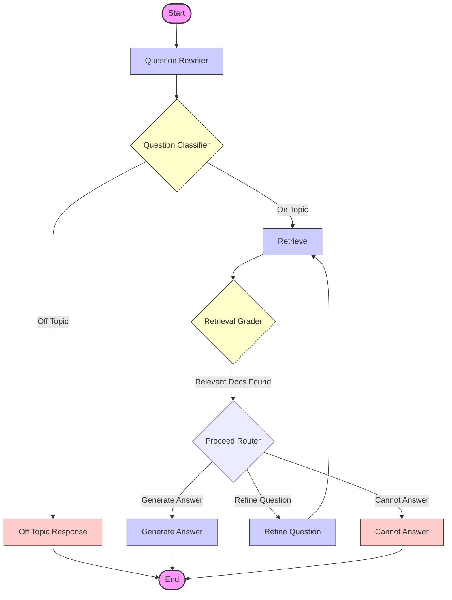

# Multi-Step Advanced RAG System

This project is an advanced Retrieval-Augmented Generation (RAG) system built with [LangChain](https://www.langchain.com/) and [LangGraph](https://langchain-ai.github.io/langgraph/). It is designed to act as a specialized chatbot for "Peak Performance Gym," capable of answering questions about the gym's history, hours, membership, classes, trainers, and facilities by retrieving information from a set of internal documents.

This system demonstrates a robust RAG workflow by incorporating:
*   **Question Rewriting**: Optimizes user queries for better retrieval.
*   **Topic Classification**: Ensures the system only answers relevant questions.
*   **Relevance Grading**: Evaluates retrieved documents to filter out irrelevant information.
*   **Iterative Refinement**: Automatically refines the question and re-retrieves if initial results are poor (up to 2 attempts).
*   **Intelligent Routing**: Directs the flow based on retrieval success and query relevance.

## Workflow Overview

The system operates as a state graph where the user's question flows through several processing steps:

1.  **Question Rewriter**: Rewrites the user's question to be self-contained and optimized for search.
2.  **Question Classifier**: Determines if the question is about the gym.
    *   *If Yes*: Proceed to retrieval.
    *   *If No*: Respond with a standard off-topic message.
3.  **Retrieve**: Searches the vector database (Chroma) for relevant documents.
4.  **Retrieval Grader**: Scores retrieved documents for relevance to the question.
    *   *If Relevant*: Proceed to generate an answer.
    *   *If Irrelevant*: Check retry count.
5.  **Refine Question**: If no relevant documents are found and retry limit is not reached, the question is refined and re-submitted to retrieval.
6.  **Generate Answer**: Uses the LLM (GPT-4o-mini) to answer the question using the retrieved context.
7.  **Cannot Answer**: If relevant documents are still not found after retries, informs the user that the information is unavailable.

### Graph Diagram

## Input Examples

The system handles various scenarios based on the input question:

### Scenario 1: On-Topic Question with Relevant Info
**User Input:**
> "Who founded Peak Performance Gym?"

**System Process:**
1.  **Rewrite**: "Who is the founder of Peak Performance Gym?"
2.  **Classify**: Relevant (Yes)
3.  **Retrieve**: Finds document about Marcus Chen.
4.  **Grade**: Document is relevant.
5.  **Generate Answer**: "Peak Performance Gym was founded in 2015 by former Olympic athlete Marcus Chen."

---

### Scenario 2: On-Topic Question with Missing Info
**User Input:**
> "What is the cancelation policy for Peak Performance Gym memberships?"

**System Process:**
1.  **Rewrite**: "What are the cancellation policies for memberships at Peak Performance Gym?"
2.  **Classify**: Relevant (Yes)
3.  **Retrieve**: Retrieves documents about membership plans (but they mention features/prices, not cancellation).
4.  **Grade**: Documents judged irrelevant.
5.  **Refine**: "What are the membership cancellation policies at Peak Performance Gym?" (Retry 1)
6.  **Retrieve**: Still no relevant docs found.
7.  **Grade**: Documents judged irrelevant.
8.  **Refine**: (Retry 2 - limit reached)
9.  **Cannot Answer**: "I'm sorry, but I cannot find the information you're looking for."

---

### Scenario 3: Off-Topic Question
**User Input:**
> "What is the best pizza place in New York?"

**System Process:**
1.  **Rewrite**: "What is the highest-rated pizza restaurant in New York City?"
2.  **Classify**: Irrelevant (No)
3.  **Off Topic Response**: "I'm sorry! I cannot answer this question!"

## Technical Details

*   **LLM**: `gpt-4o-mini` via `ChatOpenAI`
*   **Embeddings**: `OpenAIEmbeddings`
*   **Vector Store**: `Chroma` (in-memory)
*   **Framework**: `LangChain` & `LangGraph`
*   **State Management**: `AgentState` TypedDict tracks messages, documents, topic status, and retry counts.

## Requirements

*   Python 3.10+
*   `langchain`, `langgraph`, `langchain-openai`, `chromadb`, `python-dotenv`
*   Valid `OPENAI_API_KEY` in `.env` file.
